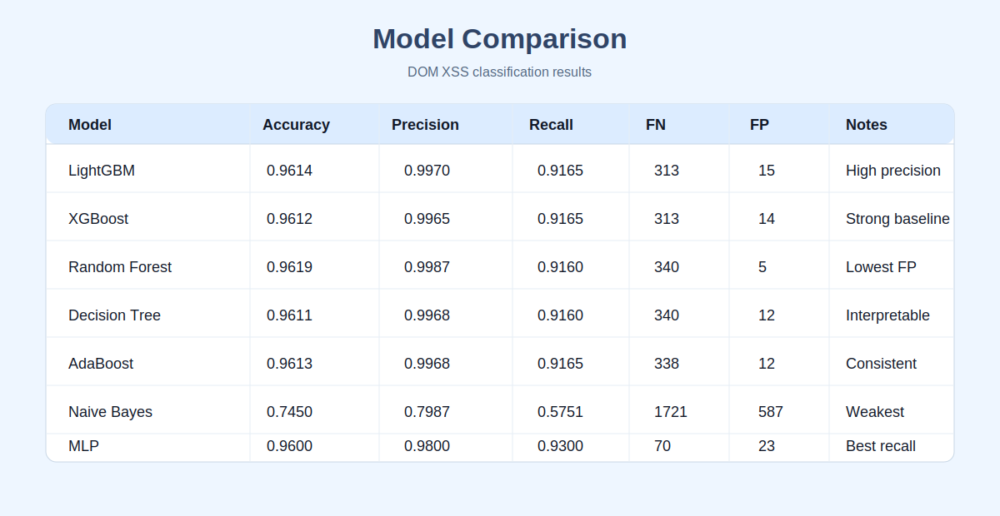
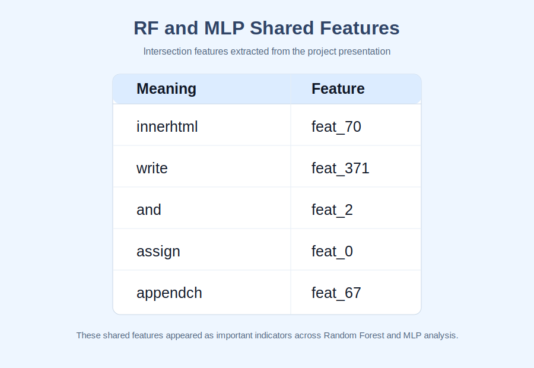

# DOM XSS ML

DOM XSS ML is an academic machine learning project for detecting DOM-Based Cross-Site Scripting (DOM XSS) through structural analysis of web page DOM content.

The repository focuses on dataset preparation, feature extraction, model training, model comparison, and trained model artifacts used for DOM XSS classification. It does not include a production frontend or backend application.

## Project Idea

DOM-Based XSS is difficult to detect because the vulnerability happens inside the browser through client-side DOM manipulation. Many traditional scanners depend on payload injection, static signatures, or server-side behavior, which can miss DOM-level vulnerabilities.

This project takes a machine learning approach: DOM samples are cleaned, converted into structural features, and used to train classification models that predict whether a page is vulnerable or non-vulnerable.

## Dataset

The original dataset used in this project is the **DOM XSS Web Vulnerability Dataset** from Carnegie Mellon University's KiltHub:

[DOM XSS Web Vulnerability Dataset](https://kilthub.cmu.edu/articles/dataset/DOM_XSS_Web_Vulnerability_Dataset/13870256)

The dataset was used as the starting point for the machine learning workflow. After collecting the raw data, it was cleaned, filtered, vectorized, and split into training, validation, and testing sets.

Dataset preparation flow:

1. Load the original DOM XSS dataset from KiltHub.
2. Clean the raw DOM samples and remove unusable records.
3. Normalize the DOM content for consistent processing.
4. Build a filtered vocabulary of important DOM tokens.
5. Convert DOM samples into numerical feature vectors.
6. Split the processed data into training, validation, and testing sets.
7. Train and evaluate multiple machine learning models on the processed dataset.

The preprocessing code is located in `preprocessing/` and helper scripts are located in `scripts/`.

## Machine Learning Models

The project trains and compares multiple supervised learning models:

- LightGBM
- XGBoost
- AdaBoost
- Decision Tree
- Random Forest
- MLP

Training scripts are stored in `training/`. Saved model artifacts and vocabulary files are stored in `models/`.

## Results

### Model Comparison



### Shared Features Between Random Forest and MLP



## Repository Structure

```text
Dom-xss-ML/
├── README.md
├── requirements.txt
├── training/
│   ├── train_lightgbm.py
│   ├── train_xgboost.py
│   ├── train_adaboost.py
│   ├── train_decision_tree.py
│   └── train_random_forest.py
├── preprocessing/
│   ├── create_vocabulary.py
│   └── vectorize_data.py
├── scripts/
│   ├── save_negative_samples.py
│   └── shuffle_data.py
├── models/
│   ├── lightgbm_best_model_final.pkl
│   ├── xgboost_best_model_final.pkl
│   ├── adaboost_best_model_final.pkl
│   ├── decision_tree_model_final.pkl
│   ├── random_forest_best_model_final.pkl
│   └── vocab_top500_filtered.pkl
├── data/
└── docs/
    └── results/
```

## Setup

Clone the repository:

```bash
git clone https://github.com/Layansabha/Dom-xss-ML.git
cd Dom-xss-ML
```

Create and activate a virtual environment:

```bash
python -m venv .venv
source .venv/bin/activate
```

Install dependencies:

```bash
pip install -r requirements.txt
```

Before running the scripts, make sure the dataset path inside each script points to the correct local dataset file.

## Example Usage

Create vocabulary:

```bash
python preprocessing/create_vocabulary.py
```

Vectorize DOM samples:

```bash
python preprocessing/vectorize_data.py
```

Train a model:

```bash
python training/train_lightgbm.py
```

## Outputs

The training scripts generate model files, evaluation reports, feature-importance outputs, and ROC curve images depending on the selected model.

## Scope

This repository focuses on DOM-Based XSS classification using structural DOM features and machine learning. It does not cover SQL Injection, CSRF, reflected XSS, stored XSS, network security, or mobile security.

## Limitations

- Model quality depends on the size and quality of the labeled dataset.
- Runtime-only DOM XSS cases may require additional browser execution or user interaction to detect.
- The current work is an academic prototype and requires further validation before production use.

## Ethical Use

This project is intended for academic research, cybersecurity learning, and authorized testing only.

## Authors

TRIO Graduation Project

- Layan Hasan Sabha

