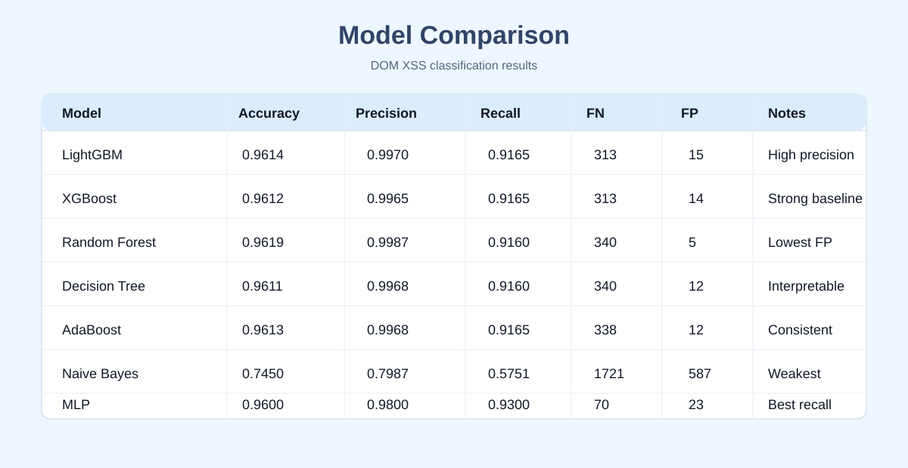
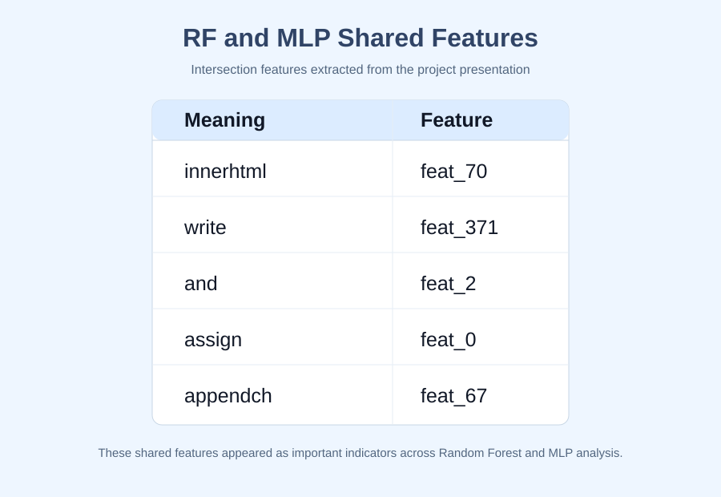

# DOM XSS ML

DOM XSS ML is an academic machine-learning project for ranking JavaScript
functions that may contain **DOM-based Cross-Site Scripting (DOM XSS)**.

The repository contains the original experiments and a reproducible,
leakage-resistant LightGBM training path for the production DOM-XSS pipeline.

## Overview

DOM-Based XSS is difficult to detect because the vulnerability happens inside the browser through user-controlled changes to the Document Object Model. Traditional scanners often depend on payload injection, static signatures, or server-side behavior, which can miss vulnerabilities that appear only through client-side DOM manipulation.

Instead of relying on payloads or brute-force testing, this project uses a machine learning approach. DOM samples are cleaned, transformed into structural features, and passed into classification models to predict whether a page is vulnerable or non-vulnerable.

## Dataset

The original dataset used in this project is the **DOM XSS Web Vulnerability Dataset** from Carnegie Mellon University's KiltHub:

[DOM XSS Web Vulnerability Dataset](https://kilthub.cmu.edu/articles/dataset/DOM_XSS_Web_Vulnerability_Dataset/13870256)

The preferred input is the dataset's raw JSONL/LZMA (`.xz`) files. The grouped
trainer also accepts the earlier XLSX samples for migration, but rejects cells
at Excel's 32,767-character limit because those feature dictionaries are
truncated.

## Data Preparation

The production model is trained by
`training/train_lightgbm_grouped.py`. It assigns complete scripts to one split,
fits the vocabulary on training data only, rejects corrupt or zero-coverage
rows, removes conflicting and duplicate feature bags, tunes on unseen
validation patterns, and reports a once-only strict test.

See [MODEL_CARD.md](MODEL_CARD.md) for provenance, exact evaluation, intended
use, limitations, and reproduction commands.

### Adding raw CMU shards safely

Do not concatenate multi-gigabyte CMU shards into the sampled XLSX file. The
streaming sampler retains every positive feature bag, takes a deterministic
reservoir of negatives from each input, and excludes scripts and exact feature
bags already present in the baseline:

```bash
python -m preprocessing.sample_cmu_shards \
  data/raw/cmu/vulnerability-data/confirmed/*.data.xz \
  --exclude data/raw/full_dataset.xlsx \
  --negative-rows-per-input 50000 \
  --output data/processed/cmu-confirmed-additions.jsonl.gz
```

The sampler writes a JSON audit beside its output. The resulting JSONL can be
passed to `training/train_lightgbm_grouped.py` together with the baseline XLSX.
Raw data and local `runs/` outputs are ignored by Git.

When the sampler finds no new positive scripts, do not add a negative-only
sample to training automatically. Use it as an external negative benchmark:

```bash
python -m evaluation.evaluate_negative_benchmark \
  data/processed/cmu-confirmed-additions.jsonl.gz \
  --model runs/baseline/models/lightgbm_grouped_model_final.pkl \
  --vocabulary runs/baseline/preprocessing/vocab_top500_grouped.json \
  --metadata runs/baseline/models/lightgbm_grouped_metadata.json \
  --output runs/baseline/docs/results/external_negative_benchmark.json
```

This reports the false-positive rate and specificity at both the
validation-selected operating threshold and `0.5`. The command fails if the
benchmark unexpectedly contains a positive row.

## Detection Workflow

The project is designed as a full detection workflow, not only a trained model:

1. DOM samples are prepared from the dataset.
2. DOM content is cleaned and normalized.
3. Structural DOM features are extracted and vectorized.
4. The processed features are passed into trained machine learning models.
5. The model produces a risk-ranking score for each function.
6. Model results are compared to evaluate detection performance.

## Models

The project trains and compares multiple supervised machine learning models:

- LightGBM
- XGBoost
- AdaBoost
- Decision Tree
- Random Forest
- MLP

The older model files are preserved for comparison. The production artifacts
are `models/lightgbm_grouped_model.txt` and
`preprocessing/vocab_top500_grouped.json`.

## Results

### Model Comparison



### Shared Features Between Random Forest and MLP



## Scope

This repository focuses on DOM-Based XSS classification using structural DOM features and machine learning. It does not cover SQL Injection, CSRF, reflected XSS, stored XSS, network security, or mobile security.

## Strict grouped LightGBM result

On the strict held-out set of unique, previously unseen feature bags:

| Threshold | Precision | Recall | F1 | PR-AUC |
|---|---:|---:|---:|---:|
| Validation-selected | 0.9545 | 0.7636 | 0.8485 | 0.9066 |
| 0.50 pre-filter | 0.8431 | 0.7818 | 0.8113 | 0.9066 |

These are function-level measurements on the cleaned sampled derivative
dataset, not a claim of page-level production accuracy.

## Limitations

- Model quality depends on the size and quality of the labeled dataset.
- Runtime-only DOM XSS cases may require additional browser execution or user interaction to detect.
- The score is a ranking signal, not a calibrated probability or proof of
  exploitability.
- The Tree-sitter production extractor is not identical to the modified
  Chromium/V8 instrumentation used to produce the research data.

## Ethical Use

This project is intended for academic research, cybersecurity learning, and authorized testing only.
